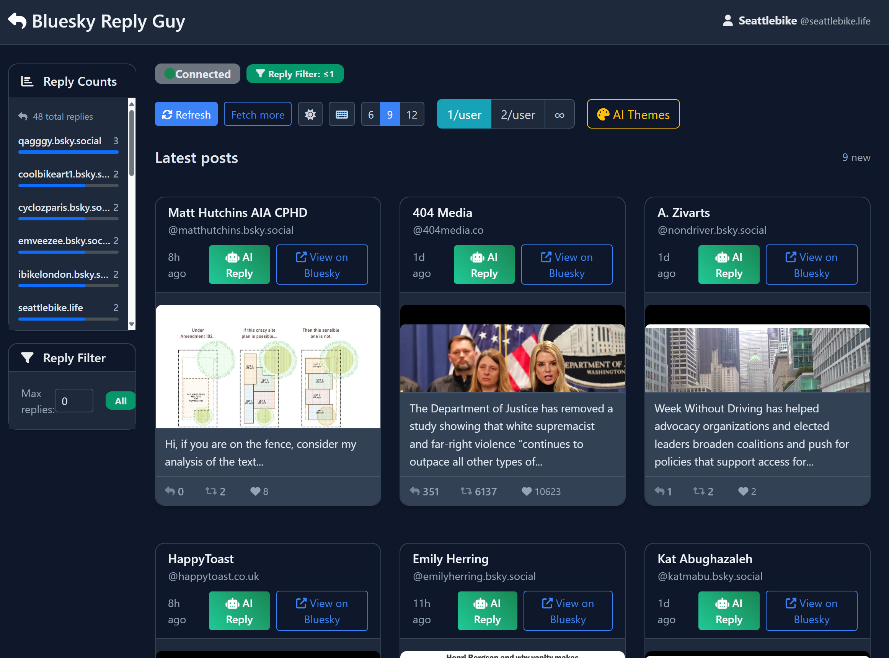
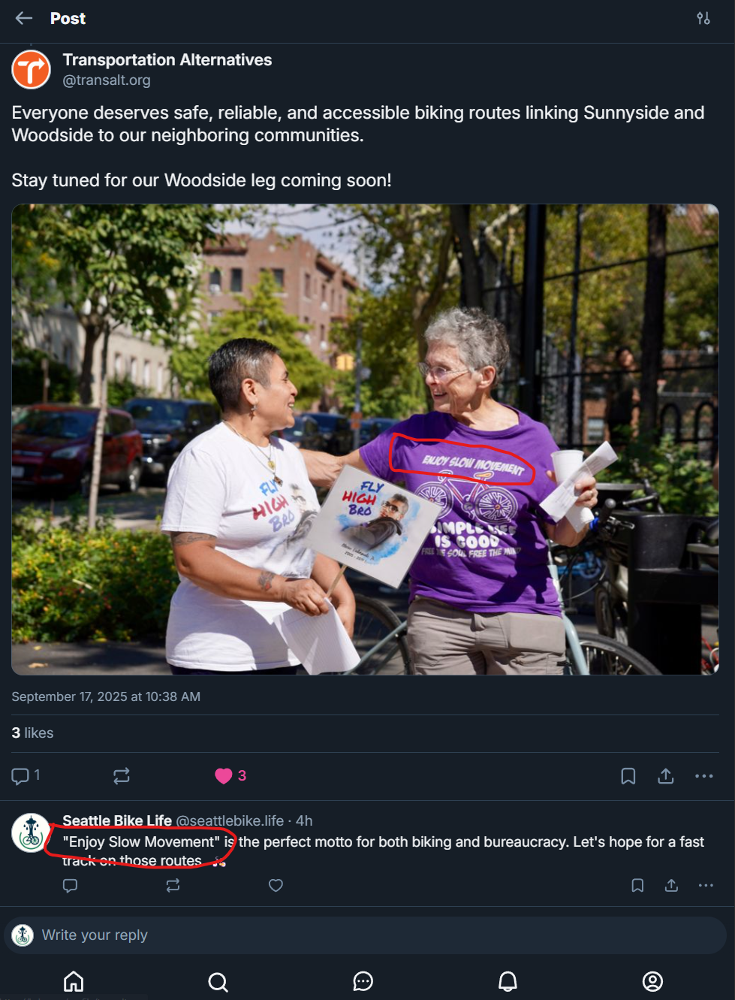

# AI-Enhanced Bluesky Feed

Web application with AI-powered image analysis, real-time analytics dashboard, and intelligent reply generation for Bluesky posts. (AKA "Bluesky Reply Guy")

<div align="center">
  
</div>

## 🧠 Concept
- Built to explore GPT-4o's multimodal capabilities (image + text in single API call)
- Focuses exclusively on posts with images/media, ignoring text-only posts
- Combines computer vision with social media interaction
- Real-time image analysis and engagement tracking

## 🛠️ Tech Stack
- **Backend**
  - Python Flask
  - AT Protocol/Bluesky API
  - OpenAI GPT-4o API
  - AWS SSM
- **Frontend**
  - HTML/CSS/JavaScript
  - Bootstrap
  - Server-Sent Events
  - Real-time analytics
- **Development**
  - Cursor AI agentic coding
  - ChatGPT reasoning assistant
- **Features**
  - Multimodal analysis
  - Reply analytics
  - Smart response generation

<div align="center">
  
  <p><em>GPT-4o analyzed the image text and incorporated it into the AI-generated response</em></p>
</div>

## 🚀 Setup
```bash
git clone <repository-url>
cd vit-sandbox
pip install -r requirements.txt
python main.py
```

## 📡 Key Endpoints
- `GET /api/posts` - Posts with AI analysis and engagement metrics
- `POST /api/ai-reply` - Generate contextual replies using multimodal analysis
- `GET /api/posts/stream` - Real-time stream of AI-analyzed posts

## 🎯 Project Status
- **Sunset**: Decided to discontinue after testing
- **Reason**: Bluesky community values authentic human interaction over AI-generated content
- **Learning**: Technical capability doesn't always align with user needs

## 🏗️ Skills Practiced
- Multimodal AI integration with GPT-4o
- AT Protocol/Bluesky API integration
- AI-assisted development workflow

## 📄 License
MIT License